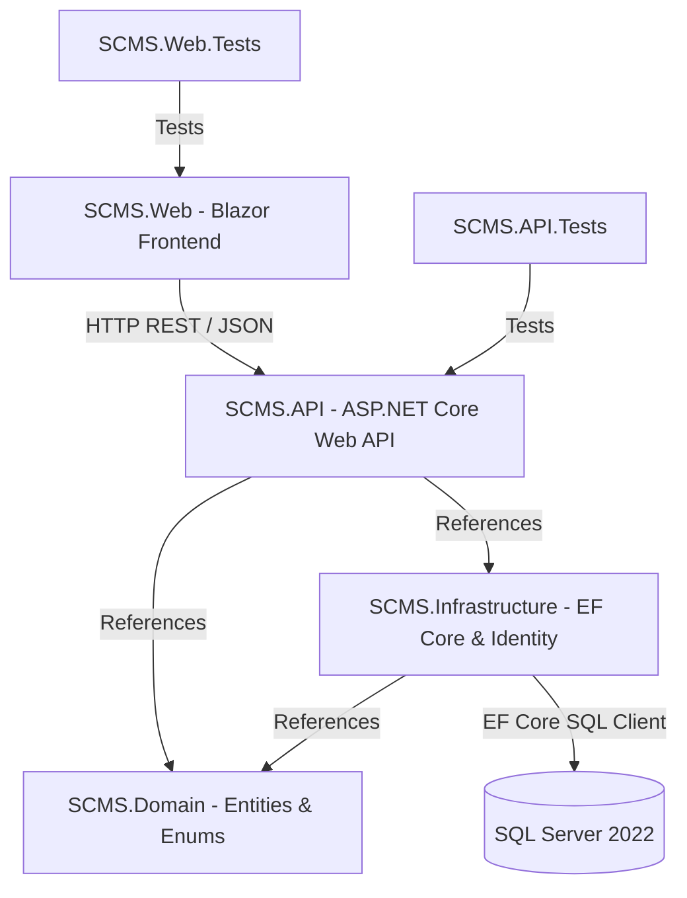

# SCMS Developer & Team Onboarding Guide

Welcome to the **Student Complaint Management System (SCMS)** repository! This guide provides step-by-step setup instructions, architecture overview, and role-specific workflows.

---

## 1. System Architecture & Component Connectivity

The SCMS solution is built on **.NET 10** using a clean, layered architecture:



### Layer Responsibilities

| Layer | Project | Responsibility |
|-------|---------|---------------|
| **Domain** | `SCMS.Domain` | Pure C# entities (`Complaint`, `Student`, `Department`, `Admin`, `Attachment`, `Notification`, `StatusHistory`, `UserSetting`) and enums (`ComplaintStatus`). Zero dependencies. |
| **Infrastructure** | `SCMS.Infrastructure` | `ApplicationDbContext` (EF Core), database configurations, indexes, FK relationships, migrations, ASP.NET Identity (`ApplicationUser`, `ApplicationRole`), and `DbInitializer` for seeding. |
| **API** | `SCMS.API` | RESTful HTTP endpoints (`Controllers/`), business logic (`Services/`), data access (`Repositories/`), DTOs, JWT auth middleware, Swagger/OpenAPI. |
| **Web** | `SCMS.Web` | Blazor pages for students (`SubmitComplaint`, `TrackComplaints`, `ComplaintDetails`) and admins (`AdminDashboard`, `AnalyticsDashboard`). Communicates with API via `HttpClient`. |
| **Tests** | `tests/` | xUnit tests for API controllers/services and Blazor components. |

---

## 2. Prerequisites & What to Install

### Option A — Docker (Recommended, no local installs needed)
- [Docker Desktop](https://www.docker.com/products/docker-desktop/)

### Option B — Manual / Local Development
1. **.NET 10 SDK**
   - Download: https://dotnet.microsoft.com/download/dotnet/10.0
   - Verify: `dotnet --version`

2. **SQL Server** (one of):
   - Windows: SQL Server Express or LocalDB (ships with Visual Studio)
   - Any OS: `docker run -e ACCEPT_EULA=Y -e MSSQL_SA_PASSWORD=... -p 1433:1433 mcr.microsoft.com/mssql/server:2022-latest`

3. **EF Core CLI Tools**
   ```bash
   dotnet tool install --global dotnet-ef
   dotnet ef --version   # verify
   ```

4. **IDE**
   - Visual Studio 2022 (v17.8+) with *ASP.NET and web development* workload
   - **OR** VS Code with *C# Dev Kit* extension

5. **Git** — verify: `git --version`

---

## 3. Getting Started & Git Workflow

### Step 1: Clone the Repository
```bash
git clone https://github.com/Dex-Infinity/SCMS.git
cd SCMS
```

### Step 2: Branching Rules

| Branch | Purpose |
|--------|---------|
| `main` | Production-ready. **Never push directly.** |
| `feat/<task-name>` | One branch per task, branched off `main` |

```bash
# Pull latest main
git checkout main
git pull origin main

# Create your feature branch
git checkout -b feat/my-task-name

# Work, commit in small chunks
git add .
git commit -m "feat: describe what you did"

# Push and open a PR into main
git push origin feat/my-task-name
```

### Step 3: Run the Stack
```bash
docker compose up --build
```

| URL | Description |
|-----|-------------|
| http://localhost:8080/swagger | API + interactive docs |
| http://localhost:8081 | Blazor Web App |

---

## 4. Environment Configuration

Secrets and environment-specific settings are managed via `appsettings.{Environment}.json` files and environment variables.

See **[ENVIRONMENT_CONFIG.md](./ENVIRONMENT_CONFIG.md)** for the full guide.

**Quick summary for local dev:**
```bash
cd src/SCMS.API
dotnet user-secrets set "Jwt:Key" "your-local-dev-secret"
dotnet user-secrets set "ConnectionStrings:DefaultConnection" "Server=...your-local-db..."
```

---

## 5. Database Migrations

Migrations apply **automatically on API startup** via `MigrateAsync()`.

To create a new migration after modifying entities or `ApplicationDbContext`:
```bash
dotnet ef migrations add <MigrationName> \
  --project src/SCMS.Infrastructure \
  --startup-project src/SCMS.API
```

To apply manually:
```bash
dotnet ef database update \
  --project src/SCMS.Infrastructure \
  --startup-project src/SCMS.API
```

**Current migrations:**
| Migration | Description |
|-----------|-------------|
| `20260831034022_AddCoreDatabaseSchema` | Initial schema — all core tables |
| `20261004034405_AddStatusHistoryAndIndexes` | StatusHistory table + performance indexes |

---

## 6. Role-Specific Guides

### A. Database Engineers (Jessica, Seglah, Collins) ✅ All complete

All entities, relationships, indexes, and migrations are implemented. Key files:

| File | Purpose |
|------|---------|
| [`SCMS.Domain/Entities/`](../src/SCMS.Domain/Entities/) | All domain entities |
| [`SCMS.Infrastructure/Data/ApplicationDbContext.cs`](../src/SCMS.Infrastructure/Data/ApplicationDbContext.cs) | EF Core config — relationships, indexes, seed data |
| [`SCMS.Infrastructure/Migrations/`](../src/SCMS.Infrastructure/Migrations/) | Migration history |
| [`docs/er-diagram.png`](./er-diagram.png) | Full ER diagram |

**Indexes on `Complaints`:**
- `StudentId` — complaints by student
- `Status` — complaints by status
- `DepartmentId` — complaints by department
- `(StudentId, Status)` — composite for filtered student queries

---

### B. Backend Developers (Virtus, Amartey) ✅ All complete

All API endpoints, services, auth, and middleware are implemented.

**Key endpoints:**

| Method | Endpoint | Description |
|--------|----------|-------------|
| `POST` | `/api/auth/register` | Register student |
| `POST` | `/api/auth/login` | Login → JWT token |
| `GET/POST` | `/api/complaints` | List / create complaints |
| `GET/PUT` | `/api/complaints/{id}` | Get / update status |
| `PUT` | `/api/complaints/{id}/assign` | Assign to dept/admin |
| `GET` | `/api/reports/summary` | Analytics |
| `GET` | `/api/notifications` | User notifications |

**To test locally:**
```bash
# Start API
cd src/SCMS.API && dotnet run

# Open Swagger
start http://localhost:5000/swagger
```

---

### C. Frontend Developers (Irene, Elikplim)

**Pages to build / wire up:**

| Page | Path | Status |
|------|------|--------|
| Submit Complaint | `Pages/Student/SubmitComplaint` | ✅ Built |
| Track Complaints | `Pages/Student/TrackComplaints` | ✅ Built |
| Complaint Details | `Pages/Student/ComplaintDetails` | ✅ Built |
| Admin Dashboard | `Pages/Admin/AdminDashboard` | 🔲 Pending |
| Analytics Dashboard | `Pages/Admin/AnalyticsDashboard` | ✅ Built |
| Notifications UI | `Shared/` | 🔲 Pending |
| Profile Page | `Pages/Profile` | 🔲 Pending |
| Settings Page | `Pages/Settings` | 🔲 Pending |

**Wire pages to API:** All pages must use the `HttpClient` services in `Services/` to call the API at `http://api:8080` (Docker) or `http://localhost:5000` (local).

---

### D. UI/UX Designers (Roselyn, Quartey) ✅ All complete

All wireframes and user flows are in [`docs/wireframes/`](./wireframes/):

| Deliverable | File |
|-------------|------|
| Student user flow | `wireframes/user-flows/student-user-flow.png` |
| Admin user flow | `wireframes/user-flows/admin-user-flow.png` |
| Student dashboard wireframe | `wireframes/student-dashboard.png` |
| Admin dashboard wireframe | `wireframes/admin-dashboard/admin-dashboard.png` |
| Reporting dashboard wireframe | `wireframes/reporting-dashboard.png` |
| Design system | `wireframes/` exports |

---

### E. DevOps Engineers (Keren, Rushdan) ✅ All complete

| Deliverable | File |
|-------------|------|
| Docker Compose with healthchecks | [`docker-compose.yml`](../docker-compose.yml) |
| Environment config guide | [`docs/ENVIRONMENT_CONFIG.md`](./ENVIRONMENT_CONFIG.md) |
| Dev appsettings | [`src/SCMS.API/appsettings.Development.json`](../src/SCMS.API/appsettings.Development.json) |
| Production appsettings | [`src/SCMS.API/appsettings.Production.json`](../src/SCMS.API/appsettings.Production.json) |
| Deployment runbook | [`docs/DEPLOYMENT.md`](./DEPLOYMENT.md) |

---

## 7. Verification & Testing

Before submitting a PR:

```bash
# 1. Restore dependencies
dotnet restore

# 2. Build entire solution
dotnet build

# 3. Run all unit tests
dotnet test

# 4. Verify API is alive (if running)
Invoke-WebRequest http://localhost:8080/swagger/v1/swagger.json
```

All builds and tests must pass cleanly before requesting a PR review.

---

## 8. Useful References

| Resource | Link |
|----------|------|
| ER Diagram | [docs/er-diagram.png](./er-diagram.png) |
| Task Assignments | [docs/TASKS.md](./TASKS.md) |
| Deployment Guide | [docs/DEPLOYMENT.md](./DEPLOYMENT.md) |
| Environment Config | [docs/ENVIRONMENT_CONFIG.md](./ENVIRONMENT_CONFIG.md) |
| Contributing Guide | [CONTRIBUTING.md](../CONTRIBUTING.md) |
| Swagger UI (live) | http://localhost:8080/swagger |
