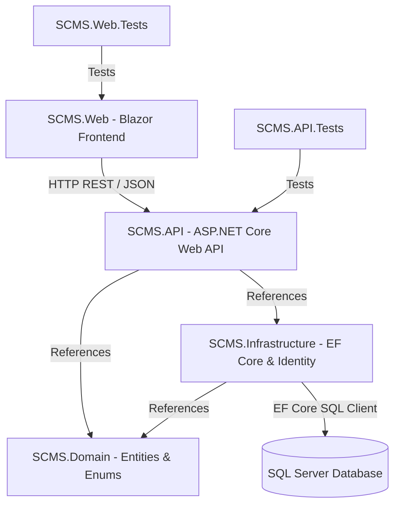

# SCMS Developer & Team Onboarding Guide

Welcome to the **Student Complaint Management System (SCMS)** repository! This comprehensive guide provides step-by-step instructions, installation prerequisites, architecture flow, component connectivity, and role-specific workflows.

---

## 1. System Architecture & Component Connectivity

The SCMS solution is built using a clean, layered architecture with .NET 8. Below is how the projects connect and interact with each other:



### Layer Responsibilities:

1. **`SCMS.Domain` (Core Business Layer)**
   - Contains pure C# domain entities (e.g., `Complaint`, `Student`, `Department`, `Notification`, `Attachment`) and Enums (e.g., `ComplaintStatus`, `PriorityLevel`).
   - Has zero dependencies on databases or UI frameworks.

2. **`SCMS.Infrastructure` (Data & Identity Layer)**
   - References `SCMS.Domain`.
   - Contains `ApplicationDbContext` (EF Core), database configurations, ASP.NET Core Identity user/role definitions, and database migrations.

3. **`SCMS.API` (Backend Service Layer)**
   - References `SCMS.Domain` and `SCMS.Infrastructure`.
   - Exposes RESTful HTTP API endpoints (`Controllers/`).
   - Houses business logic services (`Services/`), data access repositories (`Repositories/`), Data Transfer Objects (`DTOs/`), authentication middleware, and Swagger/OpenAPI documentation.

4. **`SCMS.Web` (Frontend UI Layer)**
   - Blazor Web Application.
   - Communicates with `SCMS.API` via HTTP (`HttpClient` client services in `Services/`).
   - Contains Blazor Pages (`Pages/Student/`, `Pages/Admin/`), layout navigation (`Shared/`), and static assets (`wwwroot/`).

5. **`tests/` (Test Projects)**
   - `SCMS.API.Tests`: xUnit tests for controllers and business services.
   - `SCMS.Web.Tests`: xUnit tests for Blazor UI components and services.

---

## 2. Prerequisites & What to Install

Every developer working on this project needs the following tools installed on their machine:

### Required Installations:
1. **.NET 8.0 SDK** (Version 8.0.x or higher)
   - Download: [https://dotnet.microsoft.com/download/dotnet/8.0](https://dotnet.microsoft.com/download/dotnet/8.0)
   - Verify in terminal: `dotnet --version`

2. **Database Engine (SQL Server)**
   - **Windows**: SQL Server Express or LocalDB (comes with Visual Studio).
   - **Linux / macOS**: SQL Server Docker container (`mcr.microsoft.com/mssql/server:2022-latest`) or Azure SQL Edge.

3. **EF Core CLI Tools**
   - Install globally via terminal:
     ```bash
     dotnet tool install --global dotnet-ef
     ```
   - Verify in terminal: `dotnet ef`

4. **IDE / Code Editor**
   - **Visual Studio 2022** (v17.8+ with *.NET desktop development* and *ASP.NET and web development* workloads)
   - **OR Visual Studio Code** with extensions:
     - *C# Dev Kit*
     - *GitLens*

5. **Git**
   - Verify in terminal: `git --version`

---

## 3. Getting Started & Git Workflow

### Step 1: Clone the Repository
```bash
git clone https://github.com/Dex-Infinity/SCMS.git
cd SCMS
```

### Step 2: Branching Rules & Workflow
- **`main`**: Production code only. **Do not push directly to `main`.**
- **`dev`**: Integration branch for completed features.
- **`feature/<your-task-name>`**: Create a new feature branch off `dev` for every assigned task.

#### Workflow Steps for Team Members:
```bash
# 1. Switch to dev branch and pull latest changes
git checkout dev
git pull origin dev

# 2. Create your task branch
git checkout -b feature/complaint-submission-api

# 3. Make your changes and commit in small, descriptive chunks
git add .
git commit -m "feat: add complaint submission controller and DTO"

# 4. Push your feature branch to GitHub
git push origin feature/complaint-submission-api

# 5. Open a Pull Request (PR) into dev on GitHub and request a review from a teammate.
```

---

## 4. Role-Specific Step-by-Step Task Guides

Below are step-by-step instructions for each engineering role to complete their tasks outlined in `docs/TASKS.md`.

---

### A. Database Engineers (Jessica, Seglah, Collins)

#### Task Checklist:
1. **Define Domain Entities (`SCMS.Domain`)**:
   - Create entity classes inside `src/SCMS.Domain/Entities/`:
     - `Student.cs`, `Complaint.cs`, `Department.cs`, `Attachment.cs`, `Notification.cs`, `StatusHistory.cs`.
   - Create enums in `src/SCMS.Domain/Enums/`:
     - `ComplaintStatus.cs` (`Pending`, `InReview`, `Assigned`, `Resolved`, `Rejected`).
     - `PriorityLevel.cs`.

2. **Configure DbContext (`SCMS.Infrastructure`)**:
   - Create `src/SCMS.Infrastructure/Data/ApplicationDbContext.cs`:
     ```csharp
     using Microsoft.EntityFrameworkCore;
     using SCMS.Domain.Entities;

     namespace SCMS.Infrastructure.Data
     {
         public class ApplicationDbContext : DbContext
         {
             public ApplicationDbContext(DbContextOptions<ApplicationDbContext> options) : base(options) { }

             public DbSet<Student> Students { get; set; }
             public DbSet<Complaint> Complaints { get; set; }
             public DbSet<Department> Departments { get; set; }
             public DbSet<Attachment> Attachments { get; set; }
             public DbSet<Notification> Notifications { get; set; }
         }
     }
     ```

3. **Generate EF Core Migrations**:
   - Run migration command from project root:
     ```bash
     dotnet ef migrations add InitialCreate --project src/SCMS.Infrastructure --startup-project src/SCMS.API
     ```

4. **Update Database**:
   - Apply migrations to create database tables:
     ```bash
     dotnet ef database update --project src/SCMS.Infrastructure --startup-project src/SCMS.API
     ```

5. **ER Diagram**:
   - Export your completed database ER diagram image to `docs/er-diagram.png`.

---

### B. Backend Developers (Virtus, Amartey)

#### Task Checklist:
1. **Set Up Project Folders (`src/SCMS.API/`)**:
   - Create folders: `Controllers/`, `Services/`, `Repositories/`, `DTOs/`, `Middleware/`.

2. **Configure `Program.cs` in `SCMS.API`**:
   - Register Swagger, Controllers, DbContext connection string, and Dependency Injection:
     ```csharp
     using Microsoft.EntityFrameworkCore;
     using SCMS.Infrastructure.Data;

     var builder = WebApplication.CreateBuilder(args);

     // Add Services
     builder.Services.AddControllers();
     builder.Services.AddEndpointsApiExplorer();
     builder.Services.AddSwaggerGen();

     // Register DbContext
     builder.Services.AddDbContext<ApplicationDbContext>(options =>
         options.UseSqlServer(builder.Configuration.GetConnectionString("DefaultConnection")));

     var app = builder.Build();

     if (app.Environment.IsDevelopment())
     {
         app.UseSwagger();
         app.UseSwaggerUI();
     }

     app.UseHttpsRedirection();
     app.UseAuthorization();
     app.MapControllers();

     app.Run();
     ```

3. **Create `appsettings.json`**:
   - Add database connection string:
     ```json
     {
       "ConnectionStrings": {
         "DefaultConnection": "Server=(localdb)\\mssqllocaldb;Database=SCMSDb;Trusted_Connection=True;MultipleActiveResultSets=true"
       }
     }
     ```

4. **Build DTOs & Controllers**:
   - Create `DTOs/ComplaintCreateDto.cs`, `DTOs/ComplaintResponseDto.cs`.
   - Create `Controllers/ComplaintsController.cs` with HTTP methods: `POST /api/complaints`, `GET /api/complaints`, `GET /api/complaints/{id}`, `PUT /api/complaints/{id}/status`.
   - Implement `Services/NotificationService.cs` for automated alerts.
   - Implement ASP.NET Identity authentication endpoints (Register / Login / JWT).

---

### C. Frontend Developers (Irene, Elikplim)

#### Task Checklist:
1. **Set Up Project Folders (`src/SCMS.Web/`)**:
   - Create folders: `Pages/Student/`, `Pages/Admin/`, `Shared/`, `Services/`, `wwwroot/`.

2. **Configure `Program.cs` in `SCMS.Web`**:
   - Register `HttpClient` pointing to backend API:
     ```csharp
     var builder = WebApplication.CreateBuilder(args);

     builder.Services.AddRazorPages();
     builder.Services.AddServerSideBlazor();
     builder.Services.AddScoped(sp => new HttpClient { BaseAddress = new Uri("https://localhost:7001/") });

     var app = builder.Build();
     ...
     ```

3. **Build API Client Services**:
   - Create `Services/ComplaintApiClient.cs` to fetch and send JSON data to `SCMS.API`.

4. **Build Blazor Pages & UI Components**:
   - `Shared/NavMenu.razor` & `Shared/MainLayout.razor`.
   - `Pages/Student/SubmitComplaint.razor` (Student complaint submission form with file upload).
   - `Pages/Student/TrackComplaints.razor` (List + real-time status updates).
   - `Pages/Admin/AdminDashboard.razor` (Queue, filter, assignment, and status resolution).
   - `Pages/Admin/AnalyticsDashboard.razor` (Charts & reports).

---

### D. UI/UX Designers (Roselyn, Quartey)

#### Task Checklist:
1. **Map User Flows**:
   - Define student complaint submission & tracking steps.
   - Define admin complaint review, assignment, and resolution flow.
2. **Wireframe Pages**:
   - Design low/high-fidelity wireframes for Student Portal & Admin Dashboard.
3. **Build Design System & Exports**:
   - Define color palette, typography, badges (`Pending` [yellow], `Resolved` [green], `Rejected` [red]).
   - Store design asset exports in `docs/wireframes/`.

---

### E. DevOps Engineers (Keren, Rushdan)

#### Task Checklist:
1. **Environment Configuration**:
   - Manage connection strings, secrets, and environment settings across `Development` and `Production`.
2. **CI Pipeline Maintenance**:
   - Maintain `.github/workflows/ci.yml` for automated builds and unit test verification on PRs.
3. **Deployment Runbook**:
   - Set up local/cloud database instance (SQL Server).
   - Document deployment steps for hosting `SCMS.API` and `SCMS.Web`.

---

## 5. Verification & Testing

Before submitting a PR, verify your code locally:

```bash
# 1. Restore dependencies
dotnet restore

# 2. Build entire solution
dotnet build --configuration Release

# 3. Run all unit tests
dotnet test
```

If all builds and tests pass cleanly, your feature is ready for Pull Request review!
