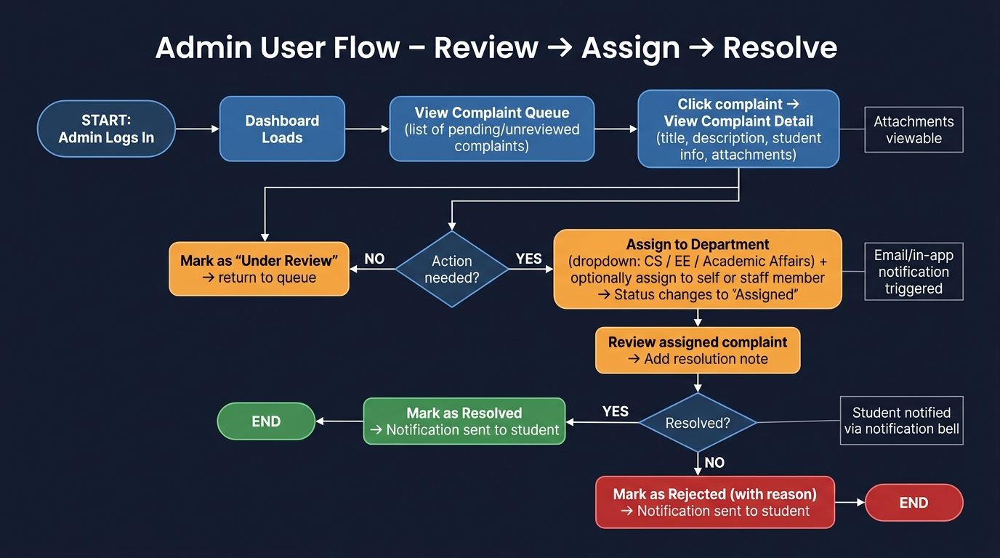

# Admin User Flow – Review → Assign → Resolve

This document describes the complete workflow an admin follows when processing a student complaint in SCMS.

## Flow Diagram



## Steps

### 1. Login & Dashboard
- Admin logs in with credentials (email + password)
- On success, redirected to the Admin Dashboard
- Dashboard shows complaint queue sorted by date (newest first)

### 2. View Complaint Queue
- List shows all complaints with status, student name, department, and submission date
- Admin can filter by: Status | Department | Date Range
- Unreviewed complaints show a **Pending** badge

### 3. Open Complaint Detail
- Click a complaint to view full details:
  - Title, description, student info (name, index number, department)
  - Submitted attachments (downloadable)
  - Current status and history

### 4. Decision: Action Needed?

#### No Action Needed
- Mark as **Under Review** → status updates, student notified
- Return to queue

#### Action Needed
- Proceed to assignment step

### 5. Assign to Department / Staff
- Select department from dropdown (Computer Science / Electrical Engineering / Academic Affairs)
- Optionally assign to a specific admin staff member
- Status automatically changes to **Assigned**
- In-app notification triggered for student

### 6. Review & Resolution
- Admin reviews the complaint once work is done
- Adds a resolution note explaining the outcome

### 7. Resolve or Reject

#### Resolved
- Mark as **Resolved**
- Student notified via notification bell + in-app alert
- Complaint closed

#### Rejected
- Mark as **Rejected** with mandatory reason
- Student notified with rejection reason
- Complaint closed

---

## Status Lifecycle

```
Pending → Under Review → Assigned → Resolved
                                  ↘ Rejected
```
